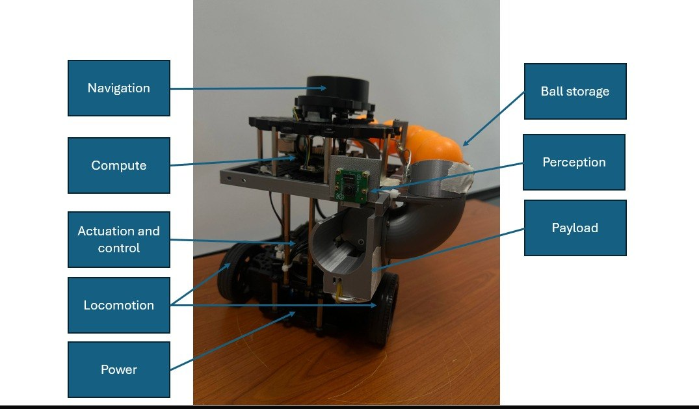
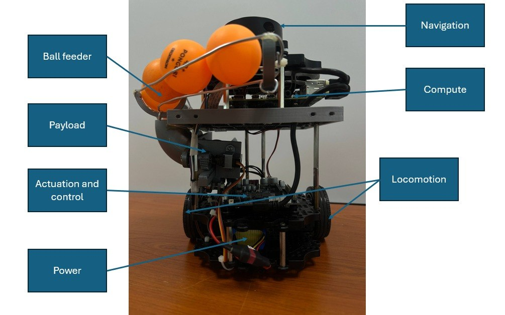
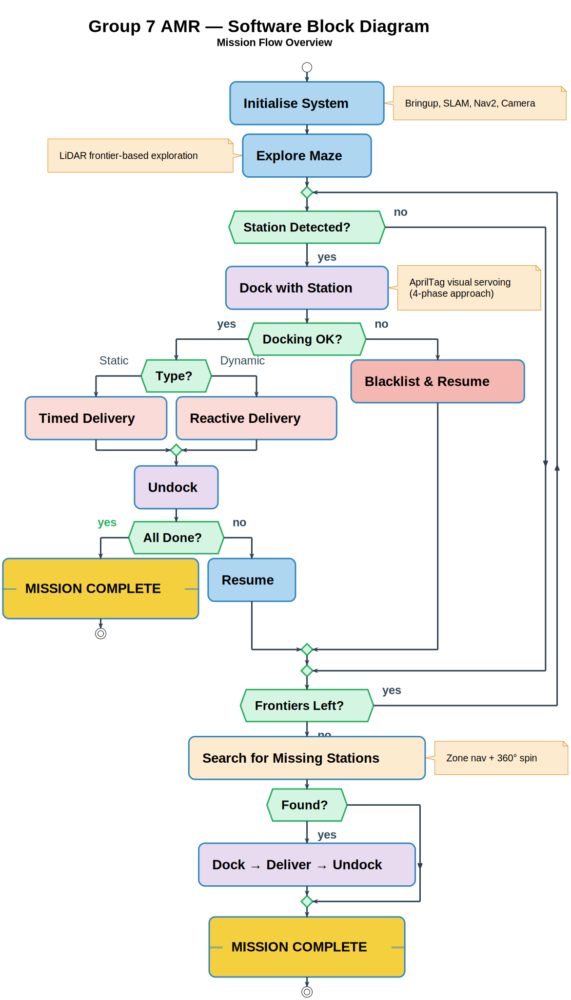

# End User Documentation

## MeowthBot AMR

*Group 7 Engineering Company Pte Ltd*

<p align="center">
  
  
</p>

*Figure 1: Robot assembly — side view (left) and front view (right).*

---

## 1. General System Description & Critical Data

**Model:** TurtleBot3 Burger (MeowthBot) — Group 7 custom payload stack.

MeowthBot is an autonomous mobile robot that maps an unknown maze using
LiDAR-based SLAM, identifies two delivery stations via AprilTag markers, docks
geometrically on each, and launches ping-pong balls with a rack-and-pinion
plunger. A ROS 2 finite-state machine coordinates explore → detect → dock →
deliver → resume, spanning a Raspberry Pi 4 on-board computer and a remote
laptop over Wi-Fi (CycloneDDS).

### 1.1 Specification sheet

| Specification | Value |
|---|---|
| Platform | TurtleBot3 Burger (MeowthBot) |
| Dimensions (base) | 235 × 230 × 24.5 mm; ~300 mm total height with payload |
| Weight | 1300 g base / 1319 g with payload |
| Power / Battery | LB-012, 11.1 V 1800 mAh LiPo (nominal run ~80 min; ~26 min under full load) |
| Drive | Differential, 2× Dynamixel **XL430-W210** |
| Max linear velocity | 0.22 m/s (configurable) |
| LiDAR | LDS-02, 360° scan, 0.12–3.5 m |
| Onboard computer | Raspberry Pi 4 |
| Motor controller | OpenCR 1.0 (9-axis IMU) |
| Camera | Raspberry Pi Camera Module V2 (CSI), 640×480 rectified @ 10 Hz |
| Station marker | AprilTag 36h11, size **0.0986 m**, IDs 0 & 2 (dock tags), ID 3 (dynamic target) |
| Launcher | MG90 continuous-rotation servo + rack-and-pinion plunger with clutch-bearing reset |
| Launcher actuator | GPIO 12 (BCM), 50 Hz PWM, `CCW_DUTY = 10.0` (fire), `CW_DUTY = 5.0` (reset) |
| Launch cycle | 0.87 s per revolution |
| Ball capacity | **7 × 40 mm** ping-pong balls (3 Station A + 3 Station B + 1 spare) |
| DDS | CycloneDDS unicast, `ROS_DOMAIN_ID=0` |
| Mission budget | 25 min wall clock; master timeout 1200 s |

### 1.2 Operation summary

1. **Explore** — Frontier-based exploration over the `/map` occupancy grid. `find_frontiers` posts clusters; `score_and_post` scores them (size + BFS distance − penalties), preflights paths with `compute_path_to_pose`, and drives Nav2.
2. **Detect** — The mission coordinator polls the TF tree at 10 Hz for `tag36h11:0` (Station A) and `tag36h11:2` (Station B), published by `apriltag_docking`. A stale-TF threshold of 0.5 s filters camera flicker.
3. **Dock** — Stage at **0.40 m** via Nav2, then run COMPUTE_GEOMETRY → INTERCEPT → SQUARE_UP → EVALUATE_POSITION → (RETRY_BACKUP) → FINAL_PLUNGE to **0.10 m**.
4. **Deliver** — Coordinator publishes `{"action":"START_DELIVERY","target":"tag36h11:<N>"}` on `/mission_command`. Station A: 3 timed shots (4 s, 6 s gaps). Station B: reactive — fires when `tag36h11:3` crosses pixel x = 320 ± 50 px; 4 s cooldown; 3 shots max.
5. **Resume** — Undock, clear blacklist, resume exploration. If exploration has timed out (default 480 s) and tags remain, enter SEARCH over pre-computed offsets.



*Figure 2: Mission flow — system block flow diagram.*

### 1.3 Safety call-outs

- **Keep fingers clear** of launcher barrel and rack-and-pinion during operation. Rubber-band-driven plunger has pinch hazard during reset.
- **LiPo safety** — do not puncture, short-circuit, or discharge below 9 V; store in fireproof bag.
- **Robot moves without warning** once exploration starts. Maintain a clear 1 m perimeter.
- **LDS-02** emits Class 1 laser light; do not stare into the aperture.
- **Emergency stop** — press the OpenCR reset button to kill all motor output immediately.

---

## 2. Technical Guide

### 2.1 Packages

| Package | Machine | Purpose | Key nodes |
|---|---|---|---|
| `auto_explore_v2` | Laptop | Frontier exploration + Nav2 goal posting | `find_frontiers`, `score_and_post` |
| `CDE2310_AMR_Trial_Run` | Laptop | Mission FSM + docking + search | `mission_coordinator`, `docking_server`, `search_server` |
| `apriltag_docking` (C++) | RPi | Camera pipeline + tag detection + dock-pose publisher | `camera_ros` → `image_proc::Resize` → `image_proc::Rectify` → `apriltag_ros::AprilTagNode` → `detected_dock_pose_publisher` (×2) |
| `CDE2310_AMR_Trial_Run` (delivery) | RPi | MG90 servo driver + shot orchestration | `delivery_server` (imports `RPi.GPIO`) |

### 2.2 Deployment — 2 terminals

Pre-flight: 7 balls loaded in the feed tube; OpenCR powered, RPi booted (~30 s); both machines on the same Wi-Fi SSID; `ROS_DOMAIN_ID=0` and `RMW_IMPLEMENTATION=rmw_cyclonedds_cpp` set on both.

**Terminal 1 — RPi** (SSH in: `ssh ubuntu@<ROBOT_IP>`)
```
export TURTLEBOT3_MODEL=burger
ros2 launch turtlebot3_bringup robot.launch.py &
ros2 launch apriltag_docking apriltag_dock_pose_publisher.launch.py &
ros2 run CDE2310_AMR_Trial_Run delivery_server
```

**Terminal 2 — Laptop**
```
ros2 launch CDE2310_AMR_Trial_Run full_mission.launch.py
```

`full_mission.launch.py` starts Cartographer (SLAM), Nav2, RViz, `auto_explore_v2`, and the mission stack (`mission_coordinator` + `docking_server` + `search_server`) after a 15 s timer delay. The robot then explores, docks, and delivers autonomously.

### 2.3 Mission command / status contract

- **Topic:** `/mission_command`, type `std_msgs/String`, payload JSON.
  - Delivery: `{"action":"START_DELIVERY","target":"tag36h11:0"}` (or `:2`).
  - Docking: `{"action":"START_DOCKING","target":"nav2_dock_target_0"}` (or `_2`).
- **Topic:** `/mission_status`, type `std_msgs/String`, payload JSON. Senders emit `"docker"`, `"searcher"`, `"deliverer"`.

### 2.4 Key tunable parameters

| Parameter | Value | File |
|---|---|---|
| `staging_distance` | 0.40 m | `docker.py:73` |
| `stop_distance` | 0.10 m | `docker.py:74` |
| `max_docking_time` | 180 s | `docker.py:78` |
| `max_allowed_y_error` | 0.40 m | `docker.py:99` |
| `master_mission_timeout` | 1200 s | `mission_coordinator_v3.py:43` |
| `initial_exploration_timeout` | 480 s | `mission_coordinator_v3.py:44` |
| `delivery_timeout` | 90 s | `mission_coordinator_v3.py:45` |
| `stale_tf_threshold` | 0.5 s | `mission_coordinator_v3.py:54` |
| `crosshair_center_x / fire_window_tolerance` | 320 / 50 px | `delivery_server_consolidated.py:32-36` |
| `cooldown_seconds` | 4.0 s | `delivery_server_consolidated.py:46` |
| Tag size | 0.0986 m | `apriltag_docking/config/apriltags_36h11.yaml:5` |

### 2.5 Shutdown

`Ctrl+C` both terminals → switch off OpenCR → disconnect LiPo if storing >24 h.

---

## 3. Acceptable Defect Log

Defects below are mission-acceptable: the system has been verified to complete a
full 25 min run despite them. None constitute a safety hazard.

| # | Defect | Justification / containment |
|---|---|---|
| 1 | Feed-tube indexing occasionally hesitates after the 5th/6th ball (gravity-fed jam near end of stack). | Mission needs at most 6 balls fired; 1 spare is carried. If it stalls, the reset lever at the top of the feed tube can be bumped by hand during pre-run; does not affect runtime after first shot. (Issue #8, Open.) |
| 2 | Camera flicker under rapidly changing overhead lighting produces single-frame false tag detections. | Stale-TF threshold of 0.5 s in `mission_coordinator_v3.py` filters transient frames before a dock is commanded. No false docks observed in 10 runs. (Issue #5, Mitigated.) |
| 3 | Nav2 occasionally rejects staging goals near the map boundary. | `docker.py` subtracts `fallback_staging_offset = 0.15 m` and retries once; the 0.40 m stage target normally falls inside traversable space. (Issue #6, Mitigated.) |
| 4 | RPi–laptop clock drift up to ~0.4 s (no NTP configured between them). | Stale-TF threshold absorbs typical drift; TF ages within mission are always <1 s. (Issue #7, Open.) |
| 5 | Launcher rubber-band force decays ~3 % per 30 firings. | Range margin at launch is designed with >15 % headroom. Rubber band is replaced every lab session regardless. |
| 6 | Minor surface roughness inside 3D-printed launcher barrel; faint layer lines on mounts. | Plunger slides freely (sanded + silicone-lubed); structural loads are below 3DP yield envelope. No functional impact. |

---

## 4. Factory Acceptance Test (FAT)

Executed once before each mission run. All rows must pass to proceed.

| # | Check | Pass criterion | ☐ |
|---|---|---|---|
| 1 | LiPo pack voltage at rest | ≥ 11.4 V on multimeter (discard <10.8 V) | ☐ |
| 2 | OpenCR bringup (Terminal 1, RPi) | `ros2 topic list` shows `/scan`, `/odom`, `/cmd_vel`; no red errors in `turtlebot3_bringup` log | ☐ |
| 3 | LiDAR scan sanity | `ros2 topic echo /scan --once` returns a full 360° range array; no all-inf readings | ☐ |
| 4 | Camera frame publishing | `ros2 topic hz /camera/image_raw` ≈ 10 Hz | ☐ |
| 5 | AprilTag detection (static bench test) | With a 0.0986 m tag-ID-0 print at 1 m, `ros2 run tf2_ros tf2_echo camera tag36h11:0` shows a fresh transform (age <0.5 s) | ☐ |
| 6 | Dock-pose publisher | `ros2 topic echo /detected_dock_pose_0 --once` returns a PoseStamped with reasonable translation (~1 m x) | ☐ |
| 7 | Nav2 path planning | In RViz, set a test goal → Nav2 returns a plan within 5 s; robot follows without oscillating into walls | ☐ |
| 8 | Nav2 goal rejection recovery | Send a goal outside the mapped area → `docker.py` retries once with fallback offset, then aborts cleanly (no node crash) | ☐ |
| 9 | Delivery fire via `/mission_command` | Publish `{"action":"START_DELIVERY","target":"tag36h11:0"}` on `/mission_command` → servo fires 3 shots at 4 s / 6 s / 4 s intervals; all balls exit barrel | ☐ |
| 10 | Dynamic delivery targeting | Publish `{"action":"START_DELIVERY","target":"tag36h11:2"}` → servo fires when tag 3 crosses pixel x ≈ 320; ≥ 1 successful shot on a rail pass | ☐ |
| 11 | Full mission dry run | Explore → detect → dock → deliver at both stations within 25 min, no manual intervention post-start | ☐ |

---

## 5. Maintenance and Part Replacement Log

Cadences below are conservative and assume roughly one full mission run plus
two short bench tests per session. The detailed CAD version lineage (Launcher
v1.0.0 → v2.2.0) is in `hardware/README.md` — do not duplicate here.

### 5.1 Routine maintenance

| Part | Replacement trigger | Cadence | Notes | Ref |
|---|---|---|---|---|
| Launcher rubber band | Visible stretch set or range drop >15 % | Every lab session, or ~30 firings | Replace with same wall-thickness band; pre-stretch under the plunger to preload | `hardware/README.md` §Rubber band vs Spring |
| MG90 continuous servo | Audible jitter at `CCW_DUTY = 10.0`; reduced torque during rack load; stall during reset | On symptom | Test in isolation via `delivery_server` STATIC sequence; swap as a unit (horn included) | `hardware/README.md` §Launcher System |
| Clutch bearing | Inconsistent pinion reset position (plunger not fully forward) | On symptom | Degrease + re-grease with light bearing grease; replace if slip-direction fails | `hardware/README.md` §Clutch bearing reset |
| Rack–pinion gear pair | Skipped teeth under load, inconsistent engagement | On symptom | Verify washer stack between rack and plunger face; inspect for 3DP tooth wear | `hardware/README.md` §Rack and pinion engagement |
| LiPo pack (LB-012) | >150 cycles, or any cell imbalance >0.05 V, or any puffing | Cycle-tracked | Log every charge; store at 3.8 V/cell if >1 week unused | §1.3 Safety call-outs |
| Standoff screws / M3 hardware | Any self-loosening between layers (visual check) | Pre-mission | Keep ≥3 standoffs per layer engaged; spare M3×8, M3×12 in kit | `hardware/README.md` §Materials and Components |
| Camera CSI ribbon | Intermittent `/camera/image_raw` dropout | On symptom | Reseat at both RPi and camera ends; replace if crimped | — |
| 3D-printed launcher barrel | Visible cracking, plunger binding | On symptom | Re-print from `hardware/cad/launcher_v2.2.0/` | `hardware/README.md` §Final Performance summary |

### 5.2 Replacement log (fill during operation)

| Date | Part replaced | Reason / symptom | By | Ref photo / ticket |
|---|---|---|---|---|
| | | | | |
| | | | | |
| | | | | |
| | | | | |
| | | | | |

---

*Group 7 Engineering Company Pte Ltd*
*Document Version 2.1 — 2026-04-19 · 5 pages max — for Final Mission submission.*
*This document must remain with the robot at all times.*
*Robot Serial: Group 7, CDE2310 AY25/26, NUS EDIC.*

*v2.1 supersedes the printed v2.0 (2026-04-16): perception package corrected to `apriltag_docking`, drive actuator to XL430-W210, docking staging distance to 0.40 m, docking FSM expanded to the 8-state `docker.py` machine, launcher FAT updated to publish on `/mission_command` (the non-existent `/fire_ball` service was removed from §4), exploration-timeout default corrected to 480 s. Regenerate the printed PDF from this file before submission.*
