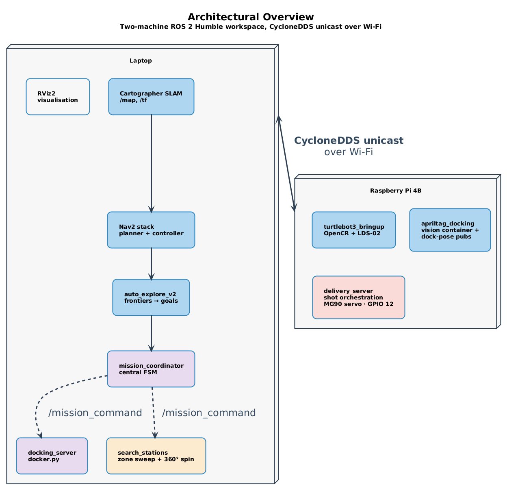
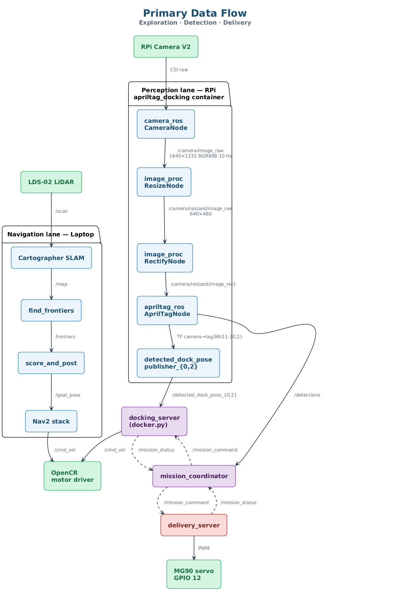
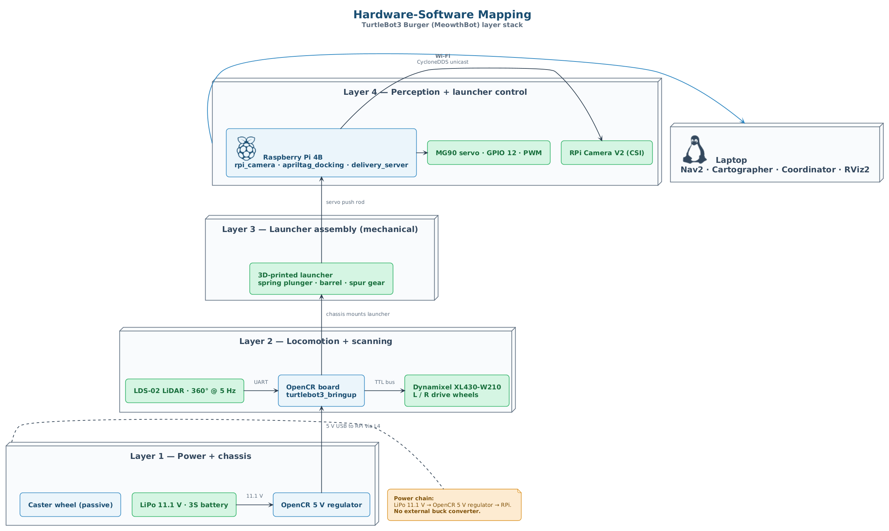

# High-Level Design

| Field          | Value                                              |
|----------------|----------------------------------------------------|
| Document ID    | AMR-HLD-001                                        |
| Version        | 1.0                                                |
| Date           | 2026-04-13                                         |
| Author(s)      | Group 7 — Jeon, Shashwat, Kuga, Clara, Daniel |
| Module         | CDE2310 Engineering Systems Design                 |
| Status         | Baselined for G2                                   |

---

## 1  Purpose

This document describes the top-level architecture of the Group 7 AMR system.
It decomposes the system into packages, maps software to hardware, and defines
the data-flow and interface topology that links every component.

---

## 2  Architectural Overview

The system follows a **two-machine distributed ROS 2** architecture. Compute-
heavy navigation and planning run on a laptop, while hardware-coupled perception
and actuation run on the Raspberry Pi mounted to the robot.



*Figure 1 — Two-machine ROS 2 Humble architecture over CycloneDDS. Source: [`../diagrams/01-hld-architectural-overview.puml`](../diagrams/01-hld-architectural-overview.puml).*

---

## 3  Package Decomposition

### 3.1  Package Map

```
src/
├── auto_explore_v2/            # Frontier exploration (Nav2 stack)
│   ├── find_frontiers.py       #   BFS frontier detection + clustering
│   └── score_and_post.py       #   Frontier scoring + Nav2 goal posting
│
└── CDE2310_AMR_Trial_Run/      # Mission-level coordination
    ├── mission_coordinator_v3.py  # Central FSM
    ├── docker.py               #   Geometric visual-servoing docking
    ├── delivery_server_consolidated.py  # Static/dynamic delivery orchestration
    └── search_stations.py      #   Zone-based tag search fallback
```

### 3.2  Package Responsibility Matrix

| Package               | Responsibility                       | Machine | Depends on            |
|-----------------------|--------------------------------------|---------|-----------------------|
| `auto_explore_v2`    | BFS frontiers, scored Nav2 goals     | Laptop  | Nav2, Cartographer    |
| `CDE2310_AMR_Trial_Run` | Central FSM, docking, delivery, search | Laptop + RPi | Nav2, TF2, auto_explore_v2 |

---

## 4  Data Flow

### 4.1  Primary Data Flow (Exploration → Detection → Delivery)



*Figure 2 — Exploration, detection and delivery data chain across the laptop / RPi split. Source: [`../diagrams/02-hld-data-flow.puml`](../diagrams/02-hld-data-flow.puml).*

### 4.2  Command / Status Bus

All coordination flows through two JSON-encoded String topics:

```
 ┌──────────────────┐          /mission_command          ┌──────────────────┐
 │  mission_        │ ──────────────────────────────────► │  docker.py       │
 │  coordinator_v3  │ ──────────────────────────────────► │  delivery_server │
 │                  │ ──────────────────────────────────► │  search_stations │
 └────────▲─────────┘                                    └──────┬───────────┘
          │                                                     │
          │              /mission_status                        │
          └─────────────────────────────────────────────────────┘

 Command format:  {"action": "START_DOCKING", "target": "tag36h11:0", ...}
 Status format:   {"sender": "docker", "status": "DOCKING_COMPLETE", "data": "tag36h11:0"}
```

---

## 5  Interface Summary

### 5.1  ROS 2 Topics (Key)

| Topic                | Type                 | Publisher(s)           | Subscriber(s)                   |
|----------------------|----------------------|------------------------|---------------------------------|
| `/map`               | OccupancyGrid        | Cartographer           | find_frontiers, search_stations |
| `/scan`              | LaserScan            | LDS-02 driver          | Cartographer, Nav2              |
| `/cmd_vel`           | Twist                | Nav2, docker          | OpenCR (motor driver)           |
| `/camera/image_raw`  | Image                | `camera_ros::CameraNode` (RPi)  | `image_proc::ResizeNode` (inside apriltag_docking container) |
| `/mission_command`   | String (JSON)        | mission_coordinator    | docker, delivery_server, searcher |
| `/mission_status`    | String (JSON)        | docker, deliverer, searcher, score_and_post | mission_coordinator |
| `/goal_pose`         | PoseStamped          | score_and_post         | Nav2 planner                    |
| `/detections`        | AprilTagDetectionArray | `apriltag_ros::AprilTagNode` (inside apriltag_docking container, RPi) | delivery_server, mission_coordinator |
| `/detected_dock_pose_{0,2}` | PoseStamped    | `apriltag_docking::detected_dock_pose_publisher_{0,2}` (RPi) | docker |
| `frontiers`          | String (JSON)        | find_frontiers         | score_and_post                  |

### 5.2  ROS 2 Services

| Service              | Type        | Server               | Client                |
|----------------------|-------------|----------------------|-----------------------|
| `toggle_exploration` | SetBool     | score_and_post       | mission_coordinator   |
| `clear_blacklist`    | Empty       | score_and_post       | mission_coordinator   |

### 5.3  ROS 2 Actions

| Action               | Type             | Server  | Client              |
|----------------------|------------------|---------|---------------------|
| `navigate_to_pose`   | NavigateToPose   | Nav2    | score_and_post, docker, search |
| `compute_path_to_pose` | ComputePathToPose | Nav2 | score_and_post      |

---

## 6  Hardware-Software Mapping



*Figure 3 — TurtleBot3 Burger (MeowthBot) layer stack. Source: [`../diagrams/03-hld-hardware-software-mapping.puml`](../diagrams/03-hld-hardware-software-mapping.puml).*

---

## 7  Technology Stack

| Layer         | Technology                                    |
|---------------|-----------------------------------------------|
| OS            | Ubuntu 22.04 (RPi + Laptop)                   |
| Middleware    | ROS 2 Humble + CycloneDDS (FastRTPS for Gazebo/WSL2) |
| SLAM          | Cartographer (google_cartographer_ros)        |
| Navigation    | Nav2 (planner, controller, behaviours, BT)    |
| Perception    | `apriltag_docking` composable container (wraps upstream `apriltag_ros`, `image_proc`, `camera_ros`) |
| Build system  | colcon + ament_python                         |
| Language      | Python 3.10                                   |
| Version ctrl  | Git + GitHub                                  |
| Camera driver | v4l2_camera (RPi Camera V2 via CSI)           |

---

## 8  Design Decisions

| ID   | Decision                                             | Rationale                                                  |
|------|------------------------------------------------------|------------------------------------------------------------|
| DD-01 | Two-machine split (RPi + laptop)                    | RPi lacks compute for Nav2 + SLAM; laptop cannot access GPIO. |
| DD-02 | JSON-encoded String topics for command/status bus    | Avoids custom message definitions; fast iteration.          |
| DD-03 | Discrete geometric docking instead of PID            | Eliminates gain-tuning; state machine is more debuggable.   |
| DD-04 | BFS frontier detection (not RRT or information-gain) | Simpler to implement and debug; sufficient for maze.        |
| DD-05 | Tag blacklisting on dock failure                     | Prevents infinite retry loops on bad-angle detections.      |
| DD-06 | `apriltag_docking` composable pipeline (wrapping upstream `apriltag_ros`) over a team-written Python detector | Zero-copy camera→detect path on the RPi; per-station `nav2_dock_target_{id}` frames + `detected_dock_pose_publisher` give Nav2-consumable PoseStamped without reinventing pose estimation. |

---

## 9  Revision History

| Version | Date       | Author | Changes            |
|---------|------------|--------|--------------------|
| 1.0     | 2026-04-13 | Jeon   | Initial baseline   |
