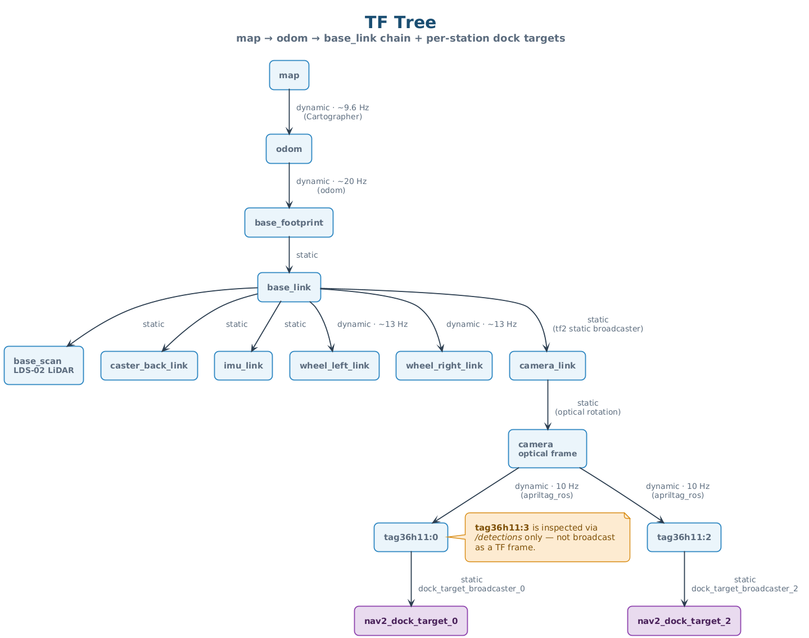

# Interface Control Document

| Field          | Value                                              |
|----------------|----------------------------------------------------|
| Document ID    | AMR-ICD-001                                        |
| Version        | 1.0                                                |
| Date           | 2026-04-13                                         |
| Author(s)      | Group 7 — Jeon, Shashwat, Kuga, Clara, Daniel |
| Module         | CDE2310 Engineering Systems Design                 |
| Status         | Baselined for G2                                   |

---

## 1  Purpose

This Interface Control Document (ICD) formally specifies every software, hardware,
and network interface in the Group 7 AMR system. It serves as the single source of
truth for node interconnections and is used during integration testing to verify
that all interfaces are correctly wired.

---

## 2  ROS 2 Topic Interfaces

### 2.1  Sensor Topics

| # | Topic                    | Message Type                          | Publisher              | Subscriber(s)                        | QoS Profile          | Machine |
|---|--------------------------|---------------------------------------|------------------------|--------------------------------------|-----------------------|---------|
| 1 | `/scan`                  | `sensor_msgs/LaserScan`              | LDS-02 driver          | Cartographer, Nav2 costmap           | Best-effort, volatile | RPi     |
| 2 | `/camera/image_raw`      | `sensor_msgs/Image`                  | `camera_ros::CameraNode` (1640×1232 BGR888 @ 10 Hz, inside `apriltag_vision_container`) | `image_proc::ResizeNode` (same container)          | Best-effort, volatile | RPi     |
| 3 | `/camera/camera_info`    | `sensor_msgs/CameraInfo`             | `camera_ros::CameraNode` | `image_proc::ResizeNode`             | Best-effort, volatile | RPi     |
| 4 | `/imu`                   | `sensor_msgs/Imu`                   | OpenCR                 | Cartographer                         | Best-effort, volatile | RPi     |
| 5 | `/odom`                  | `nav_msgs/Odometry`                 | OpenCR (diff-drive)    | Cartographer, Nav2                   | Best-effort, volatile | RPi     |

### 2.2  Map & Navigation Topics

| # | Topic                    | Message Type                          | Publisher              | Subscriber(s)                        | QoS Profile           | Machine |
|---|--------------------------|---------------------------------------|------------------------|--------------------------------------|-----------------------|---------|
| 6 | `/map`                   | `nav_msgs/OccupancyGrid`            | Cartographer           | find_frontiers, score_and_post, search_stations, Nav2 costmap | Reliable, transient local | Laptop  |
| 7 | `/goal_pose`             | `geometry_msgs/PoseStamped`          | score_and_post         | Nav2 bt_navigator                    | Reliable, volatile    | Laptop  |
| 8 | `/cmd_vel`               | `geometry_msgs/Twist`                | Nav2 controller / docking_server / search_stations | OpenCR | Reliable, volatile | Both    |

### 2.3  Perception Topics (all originate inside `apriltag_vision_container` on RPi)

| # | Topic                           | Message Type                          | Publisher                                          | Subscriber(s)                        | QoS Profile           | Machine |
|---|---------------------------------|---------------------------------------|----------------------------------------------------|--------------------------------------|-----------------------|---------|
| 9 | `/camera/resized/image_raw`     | `sensor_msgs/Image`                   | `image_proc::ResizeNode`                           | `image_proc::RectifyNode`            | Best-effort, volatile | RPi     |
| 10| `/camera/resized/camera_info`   | `sensor_msgs/CameraInfo`              | `image_proc::ResizeNode`                           | `image_proc::RectifyNode`, `apriltag_ros::AprilTagNode` | Best-effort, volatile | RPi     |
| 11| `/camera/resized/image_rect`    | `sensor_msgs/Image`                   | `image_proc::RectifyNode`                          | `apriltag_ros::AprilTagNode`         | Best-effort, volatile | RPi     |
| 12| `/detections`                   | `apriltag_msgs/AprilTagDetectionArray`| `apriltag_ros::AprilTagNode`                       | delivery_server, mission_coordinator | Best-effort, volatile | RPi     |
| 13| `/detected_dock_pose_0`         | `geometry_msgs/PoseStamped` (frame_id = `camera`) | `apriltag_docking::detected_dock_pose_publisher_0` (10 Hz) | docker                | Reliable, volatile    | RPi     |
| 14| `/detected_dock_pose_2`         | `geometry_msgs/PoseStamped` (frame_id = `camera`) | `apriltag_docking::detected_dock_pose_publisher_2` (10 Hz) | docker                | Reliable, volatile    | RPi     |
| 15| `/tf`                           | `tf2_msgs/TFMessage` (`camera → tag36h11:{0,2}`) | `apriltag_ros::AprilTagNode` (dynamic); four static broadcasters (`base_link→camera_link`, `camera_link→camera`, `tag36h11:0→nav2_dock_target_0`, `tag36h11:2→nav2_dock_target_2`) | mission_coordinator, docker | Reliable, volatile    | RPi     |

### 2.4  Mission Coordination Topics

| # | Topic                    | Message Type                          | Publisher              | Subscriber(s)                        | QoS Profile          | Machine |
|---|--------------------------|---------------------------------------|------------------------|--------------------------------------|-----------------------|---------|
| 16| `/mission_command`       | `std_msgs/String` (JSON)             | mission_coordinator    | docker, delivery_server, search_stations | Reliable, volatile | Laptop  |
| 17| `/mission_status`        | `std_msgs/String` (JSON)             | docker (`sender: docker`), delivery_server (`sender: deliverer`), search_stations (`sender: searcher`) | mission_coordinator | Reliable, volatile | Both |

### 2.5  Exploration-Internal Topics

| # | Topic                    | Message Type                          | Publisher              | Subscriber(s)                        | QoS Profile          | Machine |
|---|--------------------------|---------------------------------------|------------------------|--------------------------------------|-----------------------|---------|
| 18| `frontiers`              | `std_msgs/String` (JSON)             | find_frontiers         | score_and_post                       | Reliable, volatile   | Laptop  |
| 19| `bfs_distance_transform` | `std_msgs/String` (JSON)             | find_frontiers         | score_and_post                       | Reliable, volatile   | Laptop  |
| 20| `/nav_status`            | `std_msgs/String`                    | score_and_post         | find_frontiers                       | Best-effort, volatile | Laptop  |

---

## 3  Mission Command Protocol

All commands are JSON-encoded `std_msgs/String` messages on `/mission_command`.

### 3.1  Command Schema

```json
{
  "action": "<ACTION_NAME>",
  "target": "<tag_name or null>",
  "<extra_key>": "<extra_value>"
}
```

### 3.2  Command Catalogue

| Action            | Target            | Extra Fields            | Issued By            | Consumed By      |
|-------------------|-------------------|-------------------------|----------------------|------------------|
| `START_DOCKING`   | `tag36h11:<id>`   | —                       | mission_coordinator  | docker           |
| `START_UNDOCKING` | —                 | —                       | mission_coordinator  | docker           |
| `START_DELIVERY`  | `tag36h11:<id>`   | —                       | mission_coordinator  | delivery_server  |
| `START_SEARCH`    | `tag36h11:<id>`   | `docked_tags: [...]`    | mission_coordinator  | search_stations  |
| `ABORT_SEARCH`    | —                 | —                       | mission_coordinator  | search_stations  |

### 3.3  Status Schema

```json
{
  "sender": "<node_name>",
  "status": "<STATUS_CODE>",
  "data": "<tag_name or detail string>"
}
```

### 3.4  Status Catalogue

| Sender            | Status                 | Data                | Meaning                                |
|-------------------|------------------------|---------------------|----------------------------------------|
| `docker`          | `DOCKING_COMPLETE`     | `tag36h11:<id>`     | Robot docked at tag                    |
| `docker`          | `DOCKING_FAILED`       | `tag36h11:<id>`     | Docking aborted (timeout/geometry)     |
| `docker`          | `UNDOCKING_COMPLETE`   | —                   | Robot cleared from tag                 |
| `deliverer`       | `BALL_FIRED`           | shot detail         | Single ball confirmed fired            |
| `deliverer`       | `DELIVERY_COMPLETE`    | `tag36h11:<id>`     | All balls delivered at station         |
| `searcher`        | `SEARCH_FAILED`        | —                   | All search zones exhausted, no tag     |

**Note:** `EXPLORATION_COMPLETE` is defined in the contract but is **not currently emitted** by any node. The mission coordinator reaches SEARCHING via its `initial_exploration_timeout` instead (see Subsystem Design §2.5 "Known gap").

---

## 4  ROS 2 Service Interfaces

| # | Service              | Type                   | Server                | Client(s)              | Machine |
|---|----------------------|------------------------|-----------------------|------------------------|---------|
| 1 | `toggle_exploration` | `std_srvs/SetBool`    | score_and_post        | mission_coordinator    | Laptop  |
| 2 | `clear_blacklist`    | `std_srvs/Empty`      | score_and_post        | mission_coordinator    | Laptop  |


### 4.1  Service Details

**toggle_exploration (SetBool):**
- `request.data = true` → resume frontier exploration.
- `request.data = false` → pause (cancel active Nav2 goal, stop posting new goals).
- `response.success` always `true`; `response.message` confirms the toggle state.

**clear_blacklist (Empty):**
Clears the frontier penalty blacklist accumulated by `score_and_post`. Called by
the mission coordinator after successful dock/delivery cycles so penalised
frontiers become eligible again.

**delivery_server (consolidated):**
The delivery_server directly controls the MG90 servo via GPIO 12 on the RPi.
It handles both shot orchestration and hardware control — there is no separate
shooter node or `/fire_ball` service.

---

## 5  ROS 2 Action Interfaces

| # | Action                  | Type                              | Server    | Client(s)                   | Machine |
|---|-------------------------|-----------------------------------|-----------|-----------------------------|---------|
| 1 | `navigate_to_pose`      | `nav2_msgs/NavigateToPose`       | Nav2      | score_and_post, docker, search | Laptop  |
| 2 | `compute_path_to_pose`  | `nav2_msgs/ComputePathToPose`    | Nav2      | score_and_post              | Laptop  |

### 5.1  Action Details

**navigate_to_pose:**
- Goal: `PoseStamped` in `map` frame.
- Feedback: current pose during navigation.
- Result: success/failure status code.
- Used by exploration (scored goals), docking (staging waypoint), and search
  (zone navigation).

**compute_path_to_pose:**
- Goal: `PoseStamped` in `map` frame.
- Result: `nav_msgs/Path` — used by `score_and_post` for pre-flight validation
  before committing to a frontier goal.

---

## 6  TF Tree



*Figure 7 — Live TF tree from `ros2 run tf2_tools view_frames`. Source: [`../diagrams/07-icd-tf-tree.puml`](../diagrams/07-icd-tf-tree.puml).*

**Note:** tag36h11 ID 3 is consumed from `/detections` by the delivery server for
Station B reactive fires and is **not** broadcast as a TF frame.

**Publishers:**
- `map → odom`: Cartographer (SLAM correction).
- `odom → base_footprint → base_link`: OpenCR odometry.
- `base_link → base_scan`: LiDAR driver (TurtleBot3 bringup).
- `base_link → camera_link`: static transform publisher (apriltag_docking launch, x=0.09 y=0.05 z=0.097).
- `camera_link → camera`: static transform publisher (optical-frame rotation, yaw=-π/2 roll=-π/2).
- `camera → tag36h11:{0,2}`: `apriltag_ros::AprilTagNode` (dynamic, per-frame).
- `tag36h11:{0,2} → nav2_dock_target_{0,2}`: static transform publishers (apriltag_docking launch, x=0.195 z=0.05 pitch=-π/2 roll=π/2).

**Stale TF policy:** The mission coordinator considers a tag transform stale if
its timestamp is older than 0.5 s relative to `now()`. Stale transforms are
ignored to prevent acting on "ghost" detections.

---

## 7  Hardware Interfaces

### 7.1  GPIO / PWM (RPi 4B)

| Pin     | Function              | Connected To               | Protocol     |
|---------|-----------------------|----------------------------|--------------|
| GPIO 12 | PWM output            | MG90 servo (launcher)       | Hardware PWM |
| GND     | Common ground         | Servo, motor, OpenCR 5 V regulator | —            |

### 7.2  Serial / USB

| Interface | Protocol | Endpoints                     | Baud Rate |
|-----------|----------|-------------------------------|-----------|
| USB       | Serial   | RPi USB ↔ OpenCR              | 115200    |

The OpenCR board communicates with the RPi via USB serial. The
`turtlebot3_bringup` node handles this transparently.

### 7.3  Camera

| Interface | Protocol | Endpoints                     |
|-----------|----------|-------------------------------|
| CSI       | MIPI CSI-2 | RPi Camera V2 → RPi CSI port |

The `v4l2_camera` ROS 2 node exposes the camera as `/camera/image_raw`.

### 7.4  LiDAR

| Interface | Protocol | Endpoints                     |
|-----------|----------|-------------------------------|
| USB       | Serial   | LDS-02 → OpenCR → RPi (via USB) |

The LDS-02 LiDAR publishes 360° scans at ~5 Hz on the `/scan` topic.

---

## 8  Network Interfaces

### 8.1  DDS Configuration

| Parameter              | Value                                                             |
|------------------------|-------------------------------------------------------------------|
| DDS (real robot)       | CycloneDDS (`rmw_cyclonedds_cpp`)                                 |
| DDS (Gazebo sim, WSL2) | FastRTPS (`rmw_fastrtps_cpp`) — CycloneDDS fails under Gazebo/WSL2|
| Discovery              | Unicast peer list (no multicast)                                  |
| Discovery config       | `CYCLONEDDS_URI` → XML with explicit peer IP addresses            |
| ROS_DOMAIN_ID          | Gazebo forces `0`; real robot per operator env (not set in launch)|

**CycloneDDS XML profile** (set via `CYCLONEDDS_URI`):
- Disables multicast discovery.
- Adds peer IP addresses for unicast initial-peers list.
- Required on both machines for cross-machine topic discovery under WSL2 mirrored networking.

### 8.2  Environment Variables (Both Machines)

```bash
# Real robot (RPi + remote PC)
export RMW_IMPLEMENTATION=rmw_cyclonedds_cpp
export CYCLONEDDS_URI=file:///path/to/cyclonedds.xml

# Gazebo sim on WSL2 (overrides the above)
export RMW_IMPLEMENTATION=rmw_fastrtps_cpp
```

### 8.3  Time Synchronisation

| Parameter            | Value                                    |
|----------------------|------------------------------------------|
| Method               | Manual offset (no NTP between machines)  |
| Measured offset      | ~0.40 s (RPi ahead of laptop)            |
| Mitigation           | Stale TF threshold (0.5 s) absorbs drift |
| use_sim_time         | `false` (real hardware)                  |

---

## 9  Interface Verification Checklist

| # | Interface                           | Verification Method                          | Pass? |
|---|-------------------------------------|----------------------------------------------|-------|
| 1 | `/scan` RPi → Laptop               | `ros2 topic hz /scan` on laptop              | ☐     |
| 2 | `/camera/image_raw` on RPi          | `ros2 topic echo /camera/image_raw --once`   | ☐     |
| 3 | `/map` published by Cartographer    | Visualise in RViz                            | ☐     |
| 4 | `/cmd_vel` reaches OpenCR           | Send manual Twist, observe wheel motion      | ☐     |
| 5 | `toggle_exploration` service        | `ros2 service call` SetBool                  | ☐     |
| 6 | delivery_server servo on RPi        | Start delivery_server, verify GPIO 12 servo fires | ☐     |
| 7 | TF: `camera_link → tag36h11:0`     | Hold tag in front of camera, check `tf2_echo`| ☐     |
| 8 | `/mission_command` propagation      | Publish test JSON, verify subscriber logs    | ☐     |
| 9 | DDS cross-machine discovery         | `ros2 node list` on both machines            | ☐     |

---

## 10  Revision History

| Version | Date       | Author | Changes            |
|---------|------------|--------|--------------------|
| 1.0     | 2026-04-13 | Jeon   | Initial baseline   |
