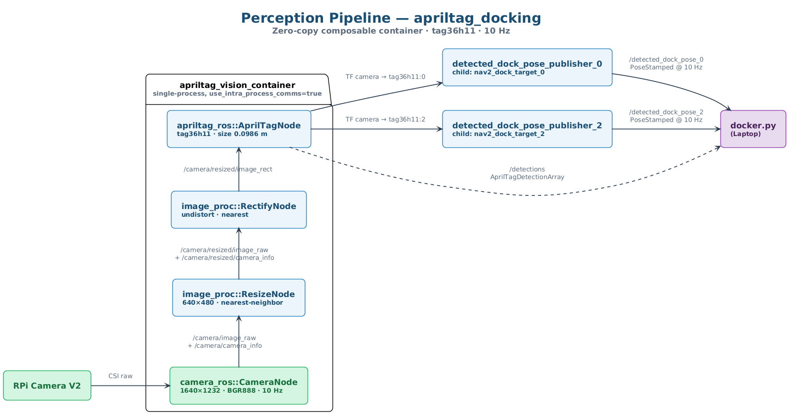
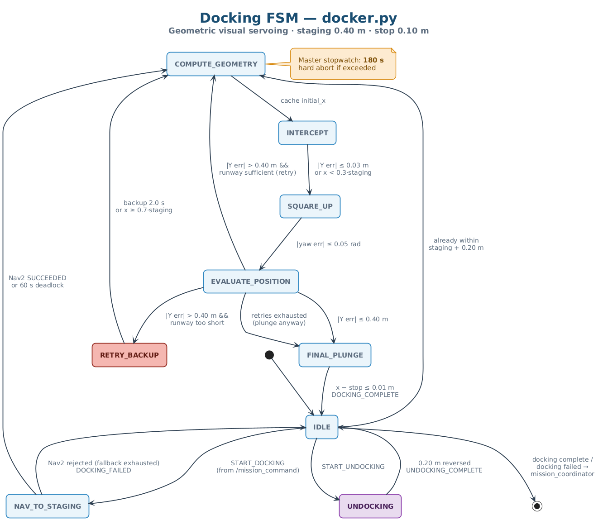
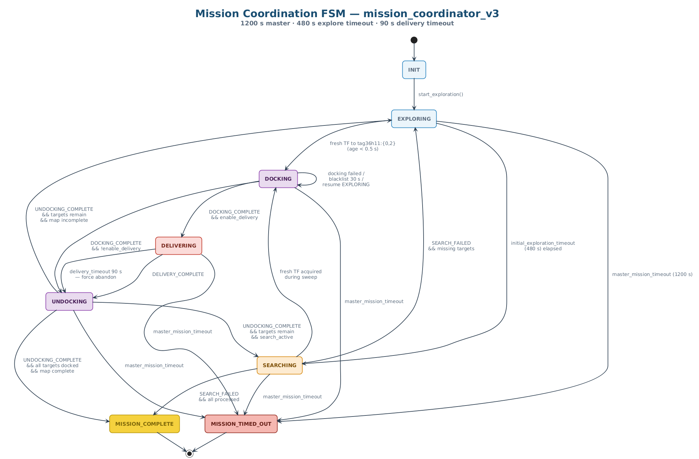

# Subsystem Design

| Field          | Value                                              |
|----------------|----------------------------------------------------|
| Document ID    | AMR-SSD-001                                        |
| Version        | 1.0                                                |
| Date           | 2026-04-13                                         |
| Author(s)      | Group 7 — Jeon, Kumaresan, Clara, Shashwat, Daniel |
| Module         | CDE2310 Engineering Systems Design                 |
| Status         | Baselined for G2                                   |

---

## 1  Purpose

This document provides detailed design information for each subsystem of the
Group 7 AMR: navigation, perception, docking, delivery, and mission coordination.
For each subsystem the document specifies purpose, key algorithms, tunable
parameters, state machines, and ROS 2 interfaces.

---

## 2  Subsystem Descriptions

### 2.1  Navigation Subsystem

#### 2.1.1  Exploration — `auto_explore_v2`

**Owner:** Kumaresan

**Purpose:** Autonomously cover the maze by repeatedly selecting and navigating
to the most promising frontier.

**Nodes:**

| Node             | File                | Role                              |
|------------------|---------------------|-----------------------------------|
| `auto_explore`   | `find_frontiers.py` | BFS frontier detection + clustering |
| `score_and_post` | `score_and_post.py` | Frontier scoring, Nav2 goal dispatch |

**Algorithm — Frontier Detection (find_frontiers.py):**

1. Subscribe to `/map` (OccupancyGrid).
2. Build a dictionary `(x, y) → cell_value` for the full grid.
3. For each free cell (value = 0), check 4-connected neighbours.
   If any neighbour is unknown (value = −1), the cell is a frontier.
4. Flood-fill (BFS) to cluster contiguous frontier cells.
   Clusters smaller than `FRONTIER_MIN_SIZE` (3) are discarded.
5. Publish cluster centroids and the BFS distance transform on
   `frontiers` and `bfs_distance_transform` topics (JSON-encoded).

**Algorithm — Frontier Scoring (score_and_post.py):**

1. For each cluster centroid, compute:
   - `bfs_dist`: cost from BFS distance transform (lower is closer).
   - `size`: number of cells in the cluster (larger frontier = more information).
2. Score = f(size, bfs_dist) — larger clusters closer to the robot are preferred.
3. Optionally pre-flight the top candidate via `ComputePathToPose` action.
   If the path is blocked (occupancy ≥ 51), discard and try the next candidate.
4. Post the winning goal to Nav2 via `NavigateToPose` action.
5. On completion or timeout, re-score and repeat.
6. When all frontiers fall below the scoring floor, publish an
   `EXPLORATION_COMPLETE` status (not currently emitted by the implementation
   — see §2.5 "Known gap"; the mission FSM relies on the exploration timeout
   instead).

**Toggle service:** `toggle_exploration` (SetBool) — the mission coordinator
pauses/resumes exploration during docking/delivery.

**Parameters:**

| Parameter              | Value | Unit  | Description                          |
|------------------------|-------|-------|--------------------------------------|
| FRONTIER_MIN_SIZE      | 3     | cells | Minimum cluster size to consider     |
| PATH_BLOCKED_OCC_MIN   | 51    | —     | Occupancy threshold for blocked path |
| PREFLIGHT_TIMEOUT_SEC  | 10.0  | s     | Timeout for ComputePathToPose check  |

---

*Note: A custom Nav2-free navigation package (`amr_nav`) was explored during
development but ultimately removed in favour of the Nav2-based stack (see
CHANGELOG 1.1.0). Its Dijkstra/A* algorithms and earlier pathfinding unit tests
are recoverable from git history (commit `044e346`).*

---

### 2.2  Perception Subsystem — `apriltag_docking`

**Owner:** Clara (integration, calibration, configuration)

**Purpose:** Detect tag36h11 AprilTag markers in the RPi camera feed, compute
6-DOF poses, and broadcast the resulting transforms plus Nav2-consumable
PoseStamped topics so mission, docking, and delivery nodes can react to tag
geometry.

**Provenance:** `apriltag_docking` is a team-authored ament_cmake (C++) ROS 2
package located at `src/apriltag_docking/`. It wraps upstream dependencies
(`camera_ros`, `image_proc`, `apriltag_ros`) into a single zero-copy
composable container and adds two bespoke elements: per-station static
`nav2_dock_target_{id}` frames, and a C++ `detected_dock_pose_publisher` node
that republishes TF lookups as `geometry_msgs/PoseStamped` at 10 Hz for Nav2
consumption. The `detected_dock_pose_publisher.cpp` node is adapted from
Addison Sears-Collins' Dec 2024 tutorial (attribution preserved in source).

**Pipeline (single composable container `apriltag_vision_container`, intra-process comms):**

*Figure 4 — `apriltag_docking` zero-copy composable container on the RPi. Source: [`../diagrams/04-ssd-perception-pipeline.puml`](../diagrams/04-ssd-perception-pipeline.puml).*

Standalone TF bridges launched alongside the container:
- `base_link → camera_link` (static, x=0.09, y=0.05, z=0.097).
- `camera_link → camera` (static optical rotation, yaw=-π/2, roll=-π/2).

**Downstream consumers:**
- `docker.py` subscribes to `/detected_dock_pose_{0,2}` for geometric servoing.
- `delivery_server_consolidated.py` subscribes to `/detections` for Station B
  reactive fires against tag36h11 ID 3.
- `mission_coordinator_v3.py` monitors the TF tree (`camera → tag36h11:{0,2}`)
  with a 0.5 s staleness threshold before acting on a tag.

**Configuration** (`src/apriltag_docking/config/apriltags_36h11.yaml`):

| Parameter              | Value        | Description                                          |
|------------------------|--------------|------------------------------------------------------|
| Tag family             | tag36h11     | Per mission brief.                                   |
| Tag size               | 0.0986 m     | Physical side length (as measured on the printed tag).|
| decimate               | 2.0          | Detector down-sample factor.                         |
| threads                | 1            | Detector worker threads (single-threaded on RPi).    |
| refine                 | true         | Edge refinement enabled.                             |
| max_hamming            | 0            | No Hamming-bit correction (strict IDs).              |
| Camera intrinsics      | Calibrated   | Produced via `camera_calibration`; loaded by `camera_ros`. |
| Broadcast tag IDs      | 0, 2         | Static and dynamic docking stations (TF frames).     |
| Detection-only tag ID  | 3            | Moving target on Station B rail; present in `/detections` only — no TF frame is broadcast. |

**Innovation vs vanilla `apriltag_ros`:** the fused composable pipeline
(resize → rectify → detect with zero-copy intra-process transport), the
per-station `nav2_dock_target_{id}` frames that encode the dock approach
geometry, and the C++ `detected_dock_pose_publisher` that converts TF lookups
into Nav2-consumable `PoseStamped` topics.

**Robustness:** Mission-side consumers guard against stale detections with a
0.5 s TF age limit and, for docking, a 1.0 s camera-dropout coast window.

---

### 2.3  Docking Subsystem — `CDE2310_AMR_Trial_Run/docker.py`

**Owner:** Shashwat

**Purpose:** Execute precision docking from a staging waypoint to the tag face
using discrete geometric visual servoing.

**Node:** `docking_server` (docker.py)

**Algorithm — Geometric Visual Servoing:**

The docking server replaces continuous PID control with an 8-state discrete
state machine. The input signal is `/detected_dock_pose_{0,2}` (PoseStamped
in the camera optical frame, published at 10 Hz by `apriltag_docking`); the
output is `/cmd_vel` twists plus one Nav2 `NavigateToPose` call per dock.

*Figure 5 — `docker.py` 8-state geometric visual-servoing FSM. Source: [`../diagrams/05-ssd-docking-fsm.puml`](../diagrams/05-ssd-docking-fsm.puml).*

**Parameters:**

| Parameter              | Value  | Unit  | Description                            |
|------------------------|--------|-------|----------------------------------------|
| staging_distance       | 0.40   | m     | Nav2 drop-off distance from tag        |
| stop_distance          | 0.10   | m     | Final approach stop from tag           |
| intercept_ratio        | 0.7    | —     | Dynamic lookahead fraction             |
| abort_ratio            | 0.3    | —     | Hard safety boundary fraction          |
| intercept_y_tolerance  | 0.03   | m     | Centreline alignment tolerance         |
| square_yaw_tolerance   | 0.05   | rad   | Yaw alignment tolerance                |
| slow_linear_speed      | 0.03   | m/s   | Approach speed                         |
| max_angular_speed      | (cap)  | rad/s | Rotation speed cap                     |
| max_docking_time       | 180    | s     | Hard timeout for entire sequence       |
| sensor_drop_tolerance  | 1.0    | s     | Camera dropout coast time              |
| fallback_staging_offset| 0.15   | m     | Subtracted on Nav2 rejection retry     |

**Robustness:**
- Camera dropout: coast on last-known `/detected_dock_pose_N` for up to
  `sensor_drop_tolerance` (1 s).
- Nav2 rejection: subtract `fallback_staging_offset` (0.15 m) and retry once;
  second rejection aborts with DOCKING_FAILED.
- Timeout: abort after `max_docking_time` (180 s) regardless of state.
- Backup: if Y error too large at `EVALUATE_POSITION`, reverse at
  `backup_speed` for `backup_duration`, then return to `COMPUTE_GEOMETRY`
  (up to `max_retries` = 3).

---

### 2.4  Delivery Subsystem

**Owner:** Clara (launcher), Jeon (delivery_server)

#### 2.4.1  delivery_server (`CDE2310_AMR_Trial_Run/delivery_server_consolidated.py`)

**Purpose:** Orchestrate ball delivery for both static and dynamic stations.

**Static Station Protocol (tag36h11:0):**
1. Receive `START_DELIVERY` command.
2. Fire ball → wait 4 s → fire → wait 6 s → fire.
3. Publish `DELIVERY_COMPLETE`.

**Dynamic Station Protocol (tag36h11:2):**
1. Receive `START_DELIVERY` command.
2. Subscribe to `/detections` (AprilTagDetectionArray).
3. When tag ID 3 is detected, fire immediately.
4. Enter 4 s cooldown.
5. Repeat until 3 shots fired or `max_dynamic_shots` reached.
6. Publish `DELIVERY_COMPLETE`.

**Parameters:**

| Parameter          | Value | Unit | Description                         |
|--------------------|-------|------|-------------------------------------|
| cooldown_seconds   | 4.0   | s    | Cooldown between dynamic shots      |
| max_dynamic_shots  | 3     | —    | Maximum shots at dynamic station    |
| TARGET_TAG_ID      | 3     | —    | Tag ID for dynamic station target   |

#### 2.4.2  Servo Control (consolidated in delivery_server)

The delivery_server directly controls the MG90 servo via GPIO 12 (hardware PWM)
on the RPi. There is no separate shooter node or `/fire_ball` service.

**Mechanism:** Servo rotates the spur gear, which drives the rack-and-pinion
plunger. The plunger compresses the spring and releases, propelling the ball
out of the barrel via a gravity-fed tube (7-ball capacity).

---

### 2.5  Mission Coordination — `mission_coordinator_v3`

**Owner:** Kumaresan (v1–v3), Jeon (robustness patches)

**Purpose:** Central FSM that orchestrates all subsystems and manages the
mission lifecycle.

**State Machine:**

*Figure 6 — `mission_coordinator_v3` state machine. Source: [`../diagrams/06-ssd-mission-fsm.puml`](../diagrams/06-ssd-mission-fsm.puml).*

**Key Mechanisms:**

| Mechanism             | Implementation                                          |
|-----------------------|---------------------------------------------------------|
| Tag monitoring        | Poll TF tree at 10 Hz for target tags (`tag36h11:0`, `tag36h11:2`) |
| Staleness filtering   | Reject TF transforms older than `stale_tf_threshold` (0.5 s) |
| Blacklisting          | HashMap `{tag: expiry_time}`, 30 s duration             |
| Clear blacklist       | `clear_blacklist` (std_srvs/Empty) client call to `score_and_post`, invoked on exploration resume so previously penalised frontiers become eligible again |
| Exploration toggle    | `toggle_exploration` (std_srvs/SetBool) service call to `score_and_post` |
| Command dispatch      | JSON on `/mission_command` topic                        |
| Status listening      | JSON on `/mission_status` topic                         |
| Exploration timeout   | `initial_exploration_timeout` (480 s) sets `timeout_search_active = True` and transitions EXPLORING → SEARCHING while un-serviced tags remain |
| Master timeout        | `master_mission_timeout` (1200 s) hard-aborts to terminal `MISSION_TIMED_OUT` |
| Delivery timeout      | `delivery_timeout` (90 s) caps time spent in DELIVERING |
| Search fallback       | Dispatches `START_SEARCH` with docked tag list          |
| Completion detection  | `docked_tags == target_tags` → MISSION_COMPLETE         |

**Known gap:** `self.exploration_completed` is declared in the coordinator
but never set to `True` in the current implementation, and no node emits
`EXPLORATION_COMPLETE` on `/mission_status`. The SEARCHING phase is therefore
only reachable via the exploration timeout above. FR-EXP-05 is reworded
against the timeout behaviour in the requirements document to reflect this.

---

### 2.6  Search Subsystem — `search_stations`

**Owner:** Kumaresan

**Purpose:** When exploration is complete but tags remain un-serviced, navigate
to pre-computed zones and spin to scan for the missing tag.

**Algorithm:**

1. On `START_SEARCH`, compute absolute search zones from relative offsets
   anchored to the robot's start position.
2. For each zone:
   a. Snap the zone coordinate to the nearest free cell on the occupancy grid
      (within `max_safe_search_radius` = 0.6 m; reduced from 1.5 m to
      avoid snapping into far-away free space during mid-arena recovery).
   b. Navigate to the safe cell via Nav2 `NavigateToPose`.
   c. On arrival (within `arrival_tolerance` = 0.4 m), spin 360° (0.5 rad/s × 13 s).
   d. If a tag interrupt occurs during spin, abort search.
3. If all zones exhausted with no detection → publish `SEARCH_FAILED`.

**Parameters:**

| Parameter              | Value     | Unit  | Description                    |
|------------------------|-----------|-------|--------------------------------|
| relative_search_offsets| [(-0.75,-0.3),(1.25,2.7)] | m | Offsets from start pose |
| max_safe_search_radius | 0.6       | m     | Max snap distance for free cell|
| spin_velocity          | 0.5       | rad/s | Rotation speed for scan        |
| spin_duration          | 13.0      | s     | Duration (covers > 360°)       |
| max_nav_retries        | 3         | —     | Nav2 retry limit per zone      |
| arrival_tolerance      | 0.4       | m     | Distance to trigger spin       |

---

## 3  Revision History

| Version | Date       | Author | Changes            |
|---------|------------|--------|--------------------|
| 1.0     | 2026-04-13 | Jeon   | Initial baseline   |
