# Hardware <!-- omit in toc -->

## Table of contents <!-- omit in toc -->
- [Overview](#overview)
  - [System Description](#system-description)
  - [Design Objectives](#design-objectives)
- [Initial concept development](#initial-concept-development)
  - [Rack and half pinion](#rack-and-half-pinion)
- [Design iterations](#design-iterations)
  - [Version 1.0.0 - first design](#version-100---first-design)
  - [Version 2.0.0 - servo integrated into launcher](#version-200---servo-integrated-into-launcher)
  - [Version 2.1.0 - bearing supports for rack and pinion](#version-210---bearing-supports-for-rack-and-pinion)
  - [Version 2.2.0 - clutch bearing reset](#version-220---clutch-bearing-reset)
  - [Final Performance summary](#final-performance-summary)
- [Key mechanism explanations](#key-mechanism-explanations)
  - [Rubber band vs Spring](#rubber-band-vs-spring)
  - [Clutch bearing reset](#clutch-bearing-reset)
  - [Rack and pinion engagement](#rack-and-pinion-engagement)
- [Materials and Components](#materials-and-components)
- [Limitations and application specific modifications](#limitations-and-application-specific-modifications)
  - [Launcher System](#launcher-system)

## Overview

This repository contains the CAD models for the payload
and mounting systems used in the AMR.

### System Description

The payload system consists of:

1. Mounting plate 
2. Camera Mount  
3. Launcher
4. Launcher mount 
5. Ball feeder

---

### Design Objectives

- Maintain robot size as much as possible
- Ensure unobstructed LiDAR view
- Position camera at optimal location for docking
- Minimize overall center of gravity
- Ensure repeatability of launcher

---
## Initial concept development

### Rack and half pinion

Concept Description

The proposed concept used a rack and half-pinion mechanism powered by a continuous rotation servo motor.

At the beginning of each cycle:

- The pinion rotates and engages the rack.
- The rack is pulled backward, retracting the plunger.
- As the plunger retracts, a ball falls into the loading position.

Once the pinion reaches the end of its rotation:

- The rack is released.
- Stored elastic energy in the rubber band drives the plunger forward.
- The ball is launched.

After launch:

- The plunger returns to its forward position.
- This forward position temporarily blocks the next ball from loading prematurely.
- This allows controlled loading of one ball per cycle.

This mechanism enabled both loading and launching to be performed using a single rotational motion.

Rationale for Choosing This Concept:

- This concept was selected due to its ability to combine multiple functions into a single mechanism.

Key advantages included:

- Single actuator operation
- Only one servo motor was required to both retract and release the plunger, reducing system complexity.
- Compact design
- The rack and pinion arrangement allowed the launcher to be positioned within a limited space.
- Low power requirements
- The use of elastic energy storage reduced the need for continuous motor torque during launching.
- Simple mechanical layout
- Fewer moving components reduced potential points of failure.

This made the design suitable for integration into the constrained mechanical layout of the robot.

Identified Limitations of Initial Concept:

Despite its advantages, several limitations were identified during early evaluation.

- Limited launch range
- The amount of stored elastic energy was restricted by the available rack travel distance.
- Potential alignment sensitivity
- Rack and pinion mechanisms require accurate alignment to prevent slipping or uneven wear.
- Dependence on consistent pinion engagement
- Incorrect starting positions could lead to failed engagement or inconsistent loading.

These limitations informed the design changes introduced in later iterations.

## Design iterations
### Version 1.0.0 - first design
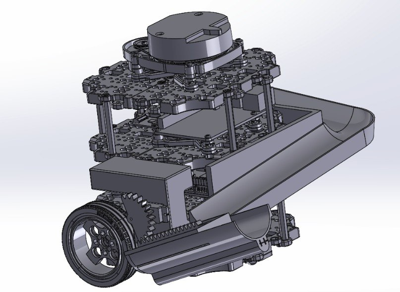

Problems Observed:

- The servo was mounted directly to the chassis instead of the launcher assembly.
This caused structural flexing during operation, leading to misalignment between the pinion and rack and resulting in slipping.
- Mounting the servo on the chassis also prevented independent testing of the launcher mechanism.
This slowed down development because launcher testing depended on Turtlebot availability.
- Nav team feedback that current poition of launcher would make moving through the maze challenging.

### Version 2.0.0 - servo integrated into launcher
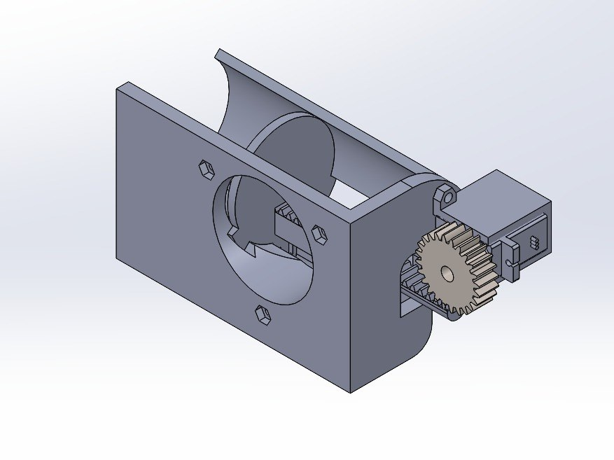
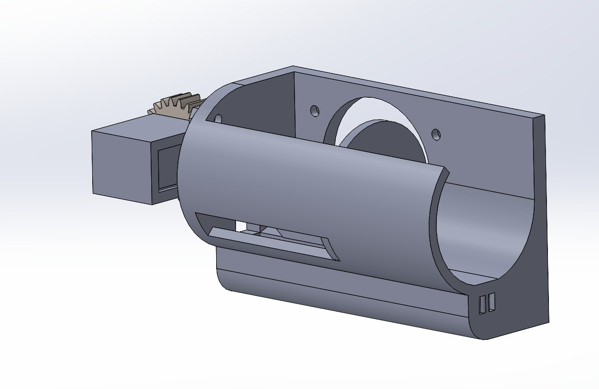

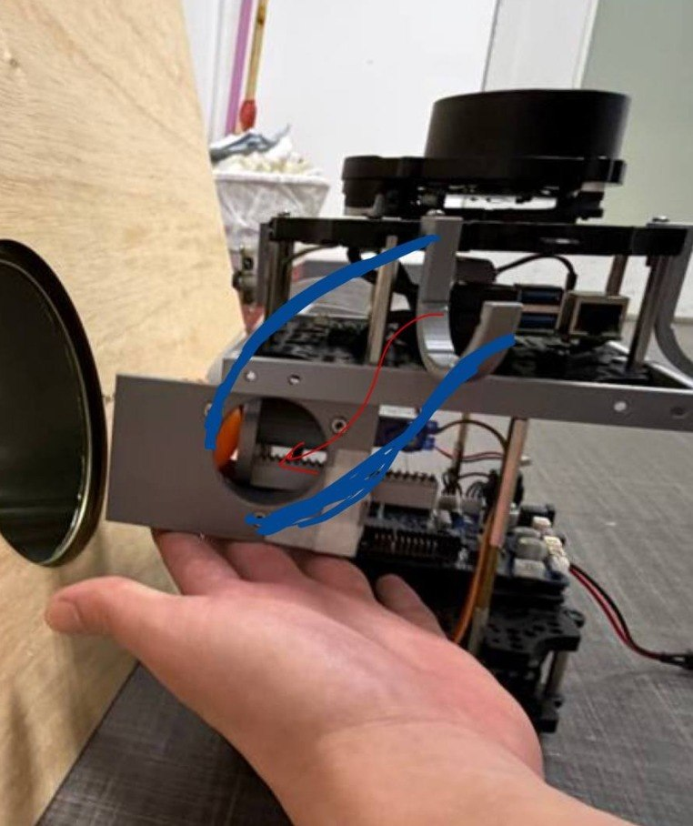

Changes from Previous Version:

- Mounted the servo directly onto the launcher assembly to reduce structural flex.
- Repositioned the launcher between waffle plates instead of side-mounted to improve structural support.

Problems Observed:

- Launcher achieved poor range, indicating insufficient stored energy and inefficiencies.
- The plunger occasionally became stuck and failed to release.
- Pinion slipping issue persisted due to insufficient constraint of both rack and pinion.
- When assembling putting plunger into tube was challenging.

Possible Root Causes:

- Rack alignment was not properly constrained.
- Pinion support was only provided on one side, allowing tilting under load.
- The plunger face and rack being one piece makes it hard and awkward to fit into the tube.

### Version 2.1.0 - bearing supports for rack and pinion
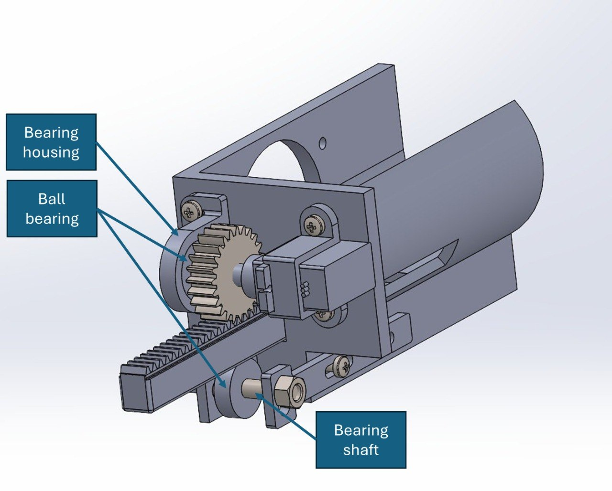

Changes from Previous Version:
- Added a ball bearing and housing to support the pinion from the opposite side, improving alignment and reducing tilting.
- Added a shaft and bearing system beneath the rack to prevent downward movement during loading.
- Replaced the spring with a rubber band to increase stored elastic energy while keeping motor torque below stall limits.
- Split plunger into plunger face and rack to be fastened together with M3 screw.

Problems Observed:
- Pinion position after each launch is inconsistent.

Possible root causes:
- Continuous servo does not have rotation control
- Tuning each rotation by time is difficult and impractical
- Rotation error after each launch stacks up 

### Version 2.2.0 - clutch bearing reset
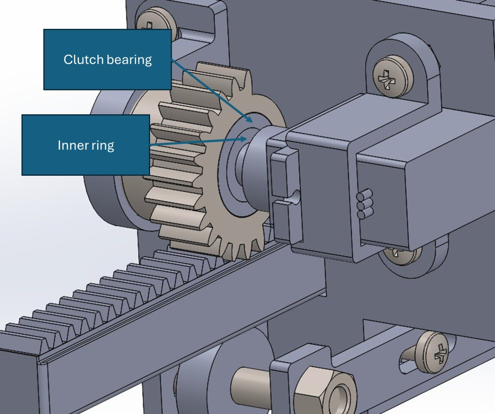
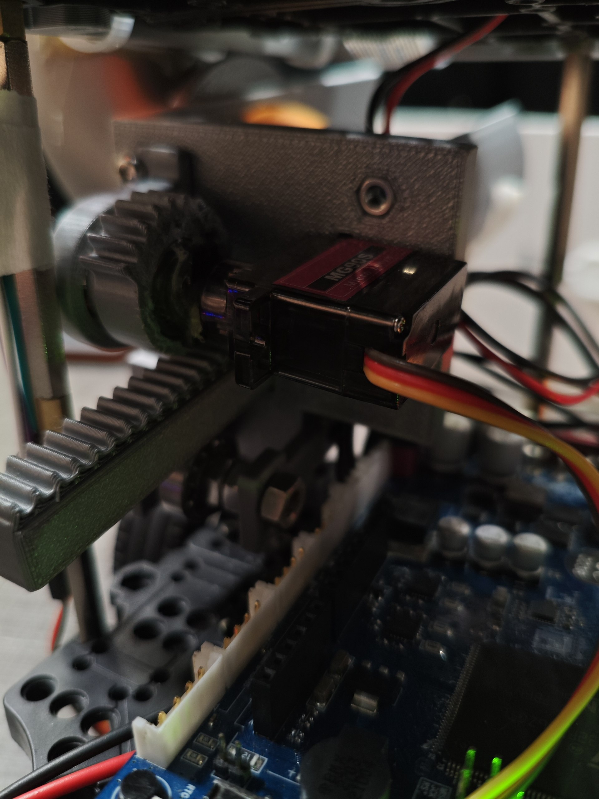

Changes from Previous Version:

- Added a clutch bearing and inner ring to allow the pinion to reset to a consistent starting position after each launch.
- Modified the pinion design to house the clutch bearing internally.

Problems Observed:

- Engagement between the pinion and rack occurred at inconsistent positions.
- In some cases, the plunger was already fully retracted before rack was released

Fix Implemented:

- Added washers between the plunger face and rack to shift the rack starting position.

Result After Fix:

- Engagement between pinion and rack became consistent.

### Final Performance summary
- No slippage between rack and pinion during repeated testing
- Consistent engagement between rack and pinion
- Pinion achieves consistent reset position
- Plunger motion is smooth and repeatable

## Key mechanism explanations

### Rubber band vs Spring

Rubber band can be already be streched when the plunger is in the fowardmost position allowing us to store more energy while keeping within the stall torque.

### Clutch bearing reset
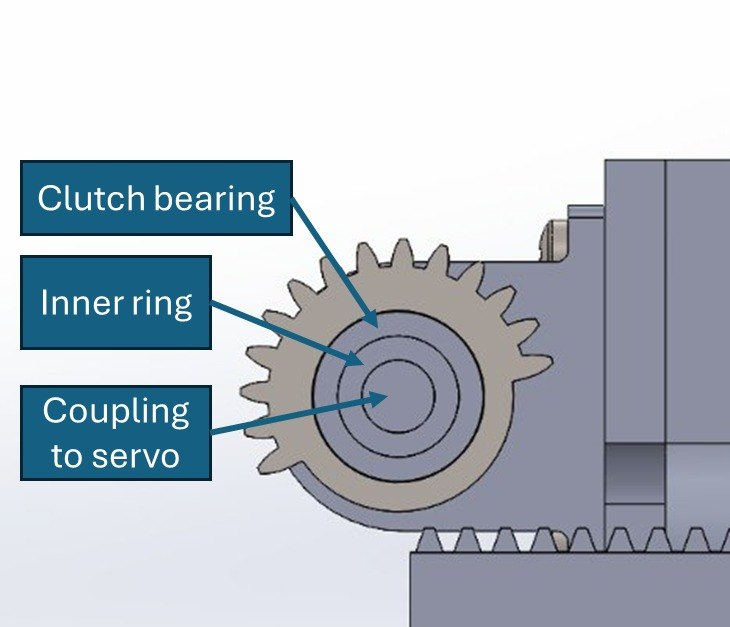

Problem: Loss of Positional Control in Continuous Servo Motors

The TowerPro MG90 Servo Motor was modified to allow continuous rotation.
As a result, positional control was lost, and the PWM signal controlled motor speed instead of angular position.

This created several issues:

- The angular position of the pinion before each launch became unpredictable.
- The time taken for one full rotation varied due to changing conditions such as rubber band tension, friction, and mechanical load.
- Small timing errors accumulated after each cycle.
- This caused inconsistent pinion starting positions, leading to unreliable launches.
- In some cases, this resulted in failed launches or multiple balls being released unintentionally.

Solution: Use of a Clutch Bearing for Passive Reset
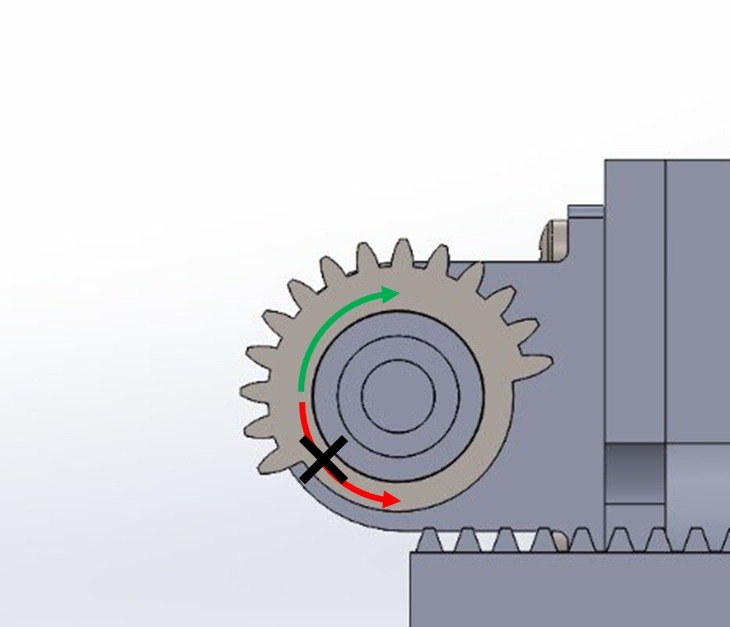

A clutch bearing was introduced to allow the pinion to reset to a consistent angular position after every launch cycle.

A clutch bearing allows rotation in one direction while locking in the opposite direction.

This directional locking property was used to create a passive mechanical reset mechanism, removing reliance on timing accuracy.

Working Principle:
1. Rack Loading Phase (Clockwise Rotation)
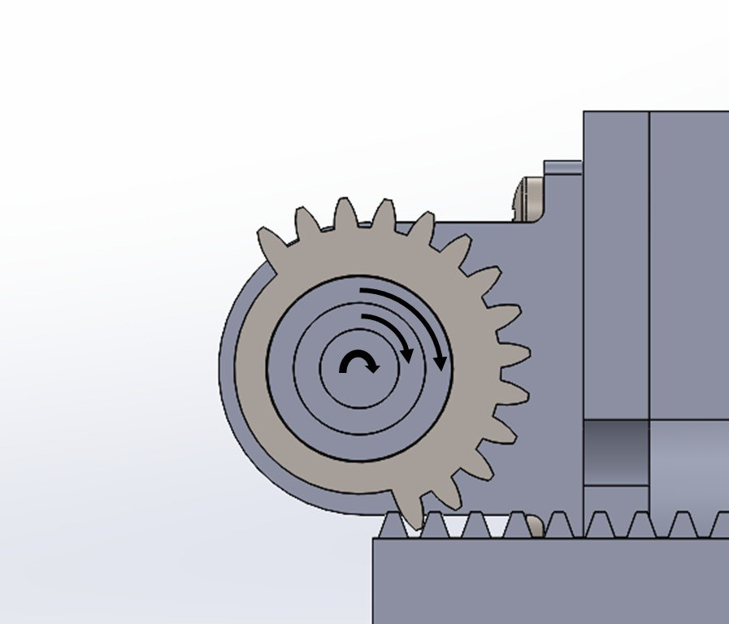

During loading:
- The servo rotates clockwise.
- The clutch bearing locks in this direction.
- Torque is transferred from the servo to the pinion.
- The pinion engages the rack and pulls it backward.
- Elastic energy is stored in the rubber band.
- The rack is released at the end of the pinion as per normal.

2. Reset Phase (Anticlockwise Rotation)
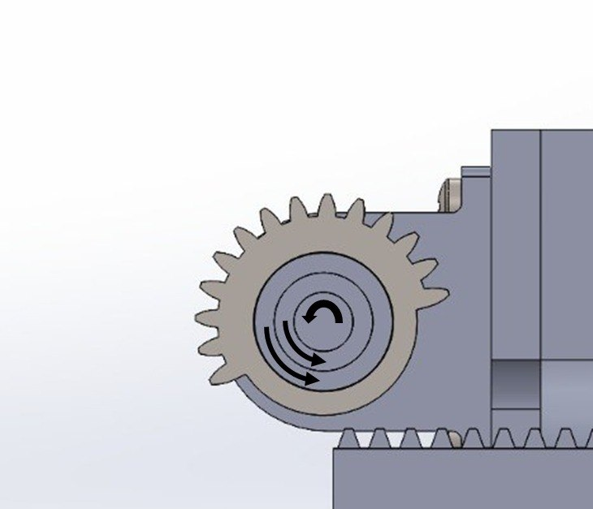

After launch:

- The servo rotates anticlockwise.
- The clutch bearing allows free rotation in this direction.
- The pinion rotates together with the servo initially.
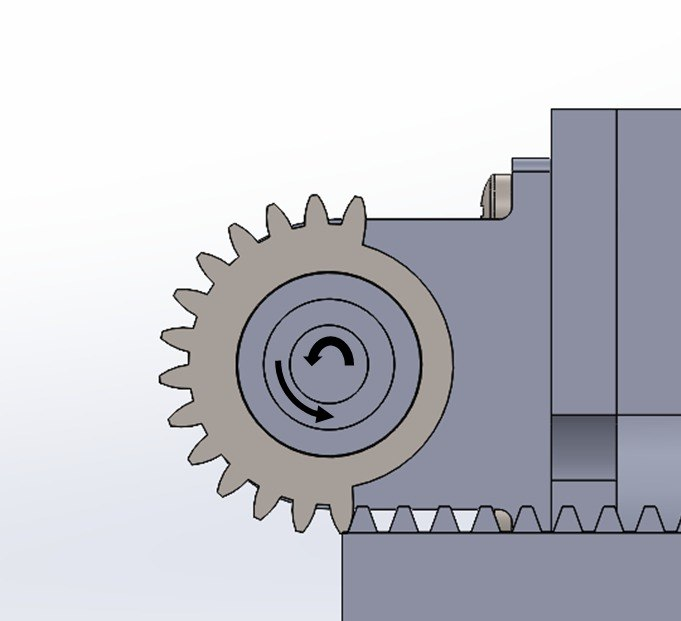
- Once the pinion reaches its reset position, the clutch slips internally.
- This allows the pinion to remain stationary while the servo continues to rotate freely.

This ensures that:

- The pinion always returns to the same angular position.
### Rack and pinion engagement
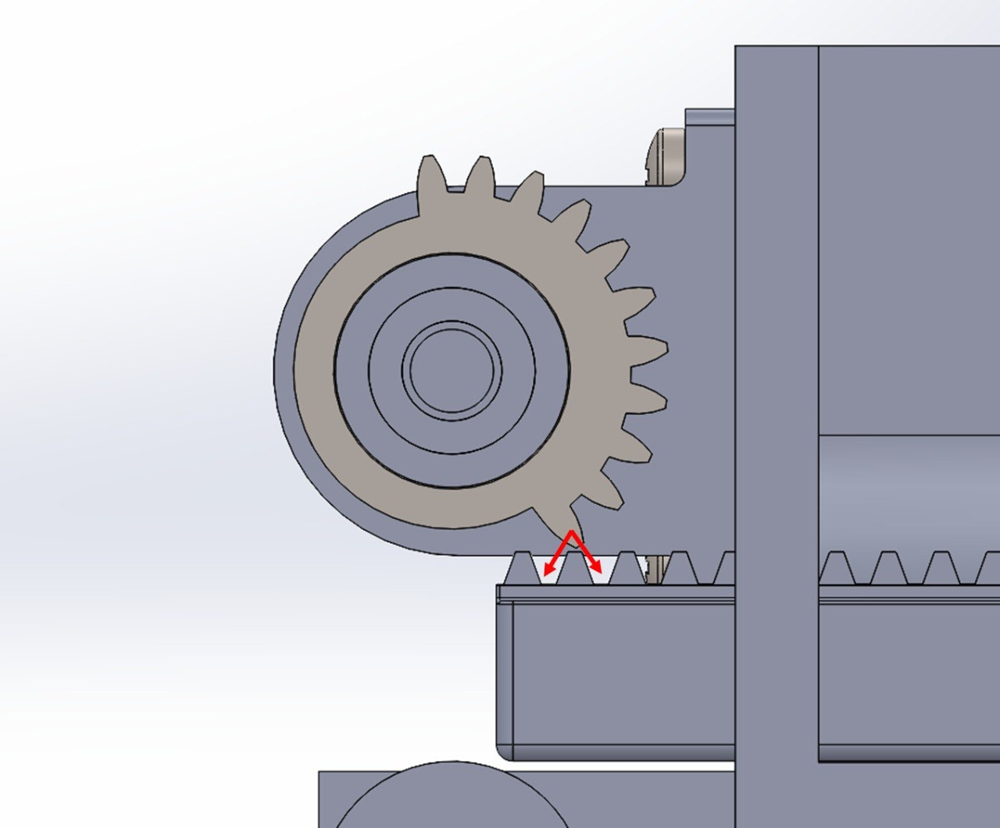
Problem: Inconsistent Rack–Pinion Engagement

The initial forward position of the rack caused inconsistent engagement with the pinion gear.

Due to the rack starting position:

- The pinion did not consistently engage the same tooth on the rack.
- Depending on the angular position of the pinion, engagement occurred randomly between adjacent teeth.

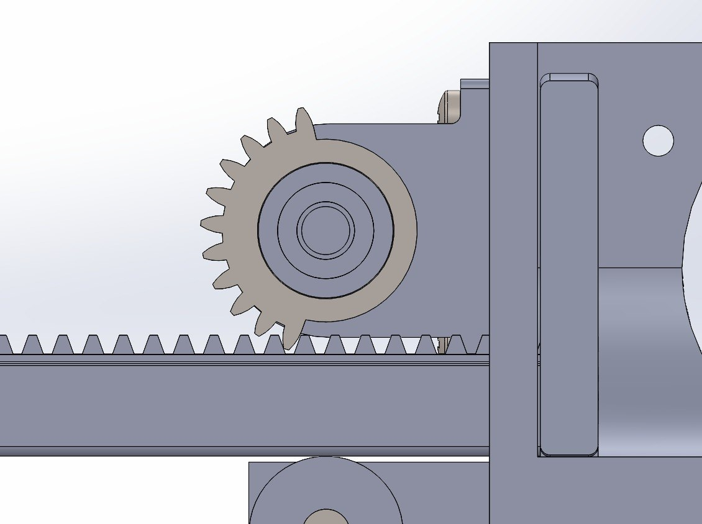
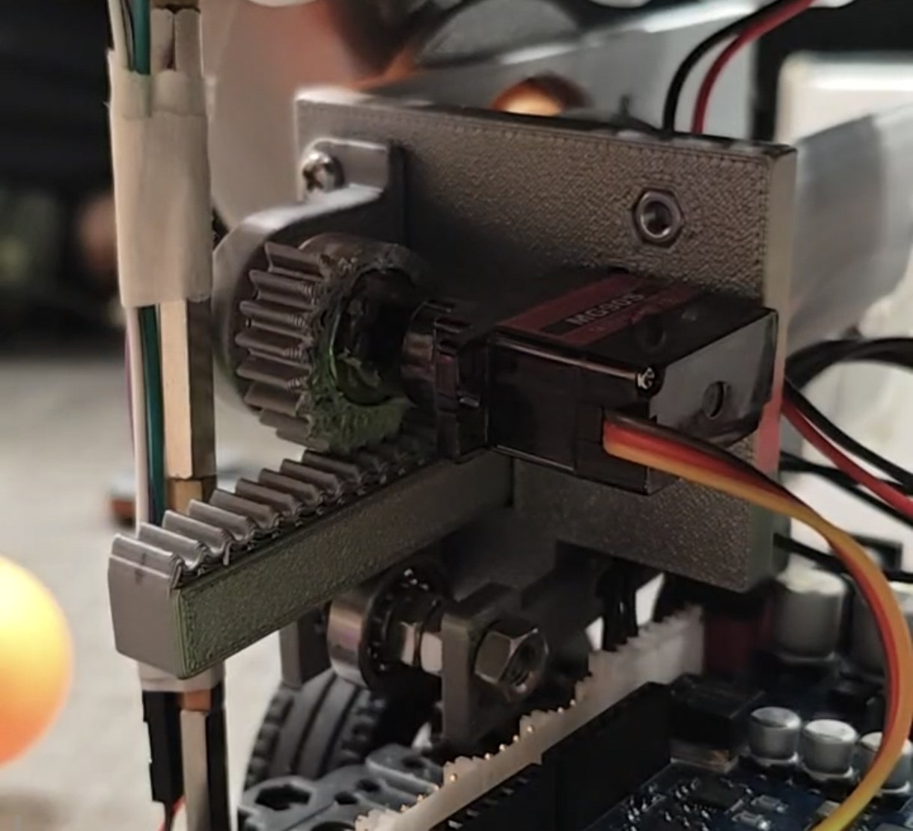

As a result:

- There were instances where the plunger got stuck and did not fire.

Fix Implemented: Rack Position Adjustment Using Washers

- To correct the engagement alignment, washers were added between the rack and the plunger face.

This modification:

Shifted the rack slightly backward relative to the pinion.
Adjusted the rack starting position to align properly with the pinion teeth.
Ensured that the pinion consistently engaged the same rack tooth during each cycle.

The number of washers was incrementally adjusted until consistent engagement was achieved.

## Materials and Components

The launcher system consisted of both custom-manufactured and purchased components.

Custom-Manufactured Components:
- Rack
- Pinion housing
- Plunger body
- Ball feeder holders
- Launcher tube

These components were manufactured using 3D printing with the following settings:
- layer height
- infill density
- etc

Purchased Components:
- Ball bearings
- Clutch bearing
- Continuous servo motor
- Aluminium wire (ball feeder)

## Limitations and application specific modifications

### Launcher System
Limitation 1 — Wear of Self-Forming Threads

- The threads used to connect the rack to the plunger face are self-forming threads.

Explanation:
- This connection experiences repeated loading and unloading during each launch cycle. As a result, the self-forming threads are subjected to cyclic fatigue and may gradually wear or loosen over time.

Impact:
- Thread wear may lead to reduced structural integrity and eventual loosening of the rack–plunger connection, reducing system reliability.

Recommended Modification:
- Replace the self-forming threads with heat-set threaded inserts to improve durability and maintain thread strength over repeated cycles.

Limitation 2 — Open Launcher Tube

- The launcher tube was designed to be fully open to allow visual observation during development and debugging.

Explanation:
- While this design simplified troubleshooting, it left the internal components exposed to external debris.

Impact:
- Foreign objects entering the launcher tube were observed to interfere with plunger motion, occasionally affecting launcher performance.

Recommended Modification:
- For deployment in real environments, the launcher tube should be redesigned as a fully enclosed structure to prevent debris ingress and improve reliability.

Ball Feeder System
Limitation 3 — Deformation of Aluminium Wire Feeder

- The ball feeder is currently constructed using aluminium wire supported by 3D-printed holders.

Explanation:
- Aluminium wire is relatively malleable and can deform under repeated loading or accidental contact.

Impact:
- Any deformation alters the alignment of the feeder path, which reduces the consistency of ball feeding and increases the likelihood of jams.

Recommended Modification:
- Replace the aluminium wire feeder with a fully 3D-printed feeder structure designed with higher rigidity and consistent geometry.